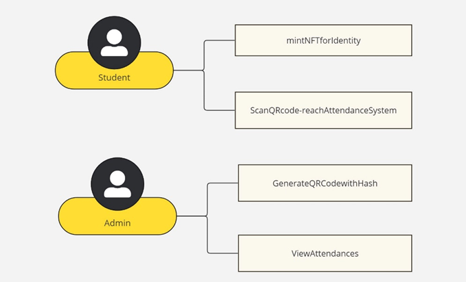
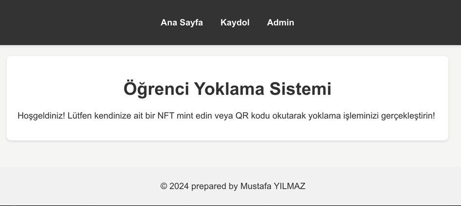
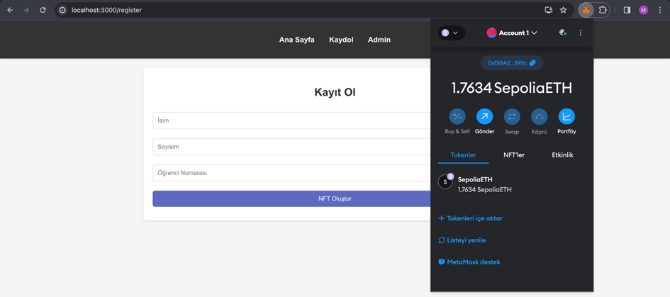
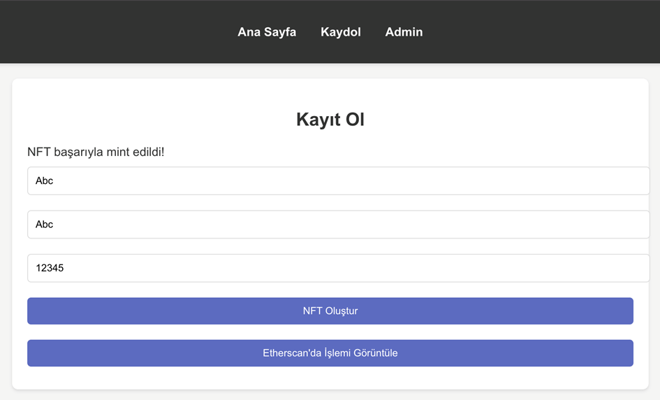
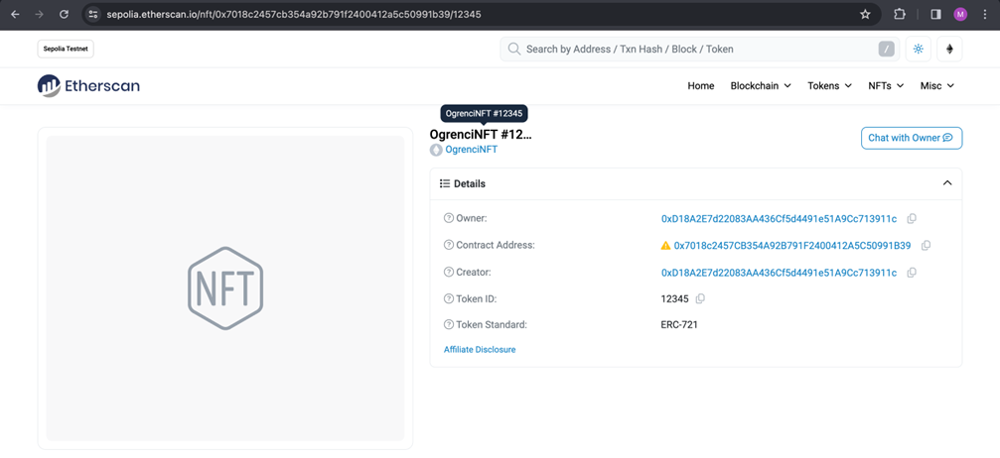
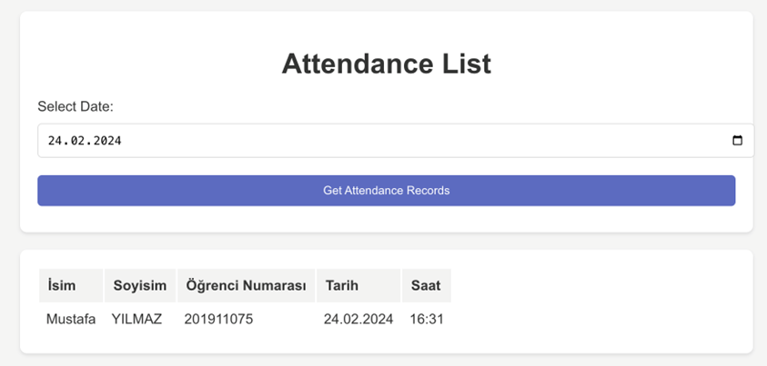

<<<<<<< HEAD
# Getting Started with Create React App

This project was bootstrapped with [Create React App](https://github.com/facebook/create-react-app).

## Available Scripts

In the project directory, you can run:

### `npm start`

Runs the app in the development mode.\
Open [http://localhost:3000](http://localhost:3000) to view it in your browser.

The page will reload when you make changes.\
You may also see any lint errors in the console.

### `npm test`

Launches the test runner in the interactive watch mode.\
See the section about [running tests](https://facebook.github.io/create-react-app/docs/running-tests) for more information.

### `npm run build`

Builds the app for production to the `build` folder.\
It correctly bundles React in production mode and optimizes the build for the best performance.

The build is minified and the filenames include the hashes.\
Your app is ready to be deployed!

See the section about [deployment](https://facebook.github.io/create-react-app/docs/deployment) for more information.

### `npm run eject`

**Note: this is a one-way operation. Once you `eject`, you can't go back!**

If you aren't satisfied with the build tool and configuration choices, you can `eject` at any time. This command will remove the single build dependency from your project.

Instead, it will copy all the configuration files and the transitive dependencies (webpack, Babel, ESLint, etc) right into your project so you have full control over them. All of the commands except `eject` will still work, but they will point to the copied scripts so you can tweak them. At this point you're on your own.

You don't have to ever use `eject`. The curated feature set is suitable for small and middle deployments, and you shouldn't feel obligated to use this feature. However we understand that this tool wouldn't be useful if you couldn't customize it when you are ready for it.

## Learn More

You can learn more in the [Create React App documentation](https://facebook.github.io/create-react-app/docs/getting-started).

To learn React, check out the [React documentation](https://reactjs.org/).

### Code Splitting

This section has moved here: [https://facebook.github.io/create-react-app/docs/code-splitting](https://facebook.github.io/create-react-app/docs/code-splitting)

### Analyzing the Bundle Size

This section has moved here: [https://facebook.github.io/create-react-app/docs/analyzing-the-bundle-size](https://facebook.github.io/create-react-app/docs/analyzing-the-bundle-size)

### Making a Progressive Web App

This section has moved here: [https://facebook.github.io/create-react-app/docs/making-a-progressive-web-app](https://facebook.github.io/create-react-app/docs/making-a-progressive-web-app)

### Advanced Configuration

This section has moved here: [https://facebook.github.io/create-react-app/docs/advanced-configuration](https://facebook.github.io/create-react-app/docs/advanced-configuration)

### Deployment

This section has moved here: [https://facebook.github.io/create-react-app/docs/deployment](https://facebook.github.io/create-react-app/docs/deployment)

### `npm run build` fails to minify

This section has moved here: [https://facebook.github.io/create-react-app/docs/troubleshooting#npm-run-build-fails-to-minify](https://facebook.github.io/create-react-app/docs/troubleshooting#npm-run-build-fails-to-minify)
=======
# Attendance System with WEB3.0 Project

## Project Overview

This project aims to implement an Attendance System using WEB3.0 technologies, specifically leveraging Blockchain and NFTs. The system involves smart contracts, NFT minting, and dynamic QR code generation for attendance tracking.

## Design

### Key Features

1. **Blockchain-based Attendance Records:**
   - Smart contracts are utilized to maintain attendance records, ensuring transparency and reliability through Blockchain technology.

2. **NFT Minting for Students:**
   - Students mint NFTs containing personal information, serving as digital ID cards for attendance transactions.

3. **Admin Panel with Dynamic QR Codes:**
   - Admin can create dynamic QR codes for student access and query attendance records via smart contracts. This involves bilateral smart contract design.

## Code Work

### React Interface

- Node.js and React are used to set up the frontend interface, making use of up-to-date JavaScript libraries for wallet and smart contract connections.
- Basic HTML/CSS and JS knowledge is applied in designing the main page.

### Register Component

#### User Registration

- Users' digital wallets are automatically connected.
- Implemented error handling for wallet connection.
- Registration form captures name, surname, and student/participant numbers.
- NFT creation process initiated upon clicking "Create NFT" button.

#### Smart Contract and NFT Creation

- Digital wallet connections established using the "ethers" library.
- Solidity smart contract written for NFT creation on REMIX-IDE.
- Smart contract deployed to Sepolia test network.
- Backend connections for smart contract interaction set up.
- IPSF system integrated for NFT metadata standards.

### Admin Panel Component

#### Admin Login

- Admin login page designed with server-side operations.
- Login control, authToken creation, and Dynamic QR code generation on the Express server.

#### Dynamic QR Code Component

- 10-character hash code generated changing every 60 seconds.
- "qrcode.react" library used for converting hash code to URL format.
- QR code displayed on frontend with countdown to code change.

### Attendance Process

#### Attendance Component

- Hash code validity checked from URL on backend.
- Students' digital wallets connected automatically.
- Checks in a second smart contract for wallet-address verification and attendance history.
- Attendance smart contract deployed to the test network.

#### Attendance List Component

- Date-based control of attendance processes for admin.
- Retrieval of personal information and attendance time from smart contract.
- Visualization of attendance data in a table format.

## Conclusion

Successfully implemented all outlined project features, ensuring effective communication between components.

>>>>>>> 51c3c71f7af6a4f89f1c61676a3733445d7b2479
